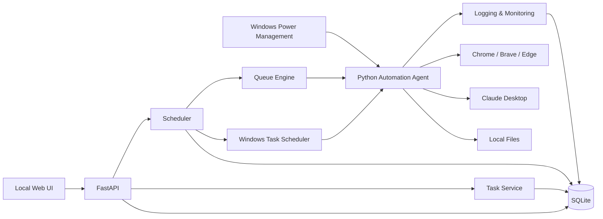
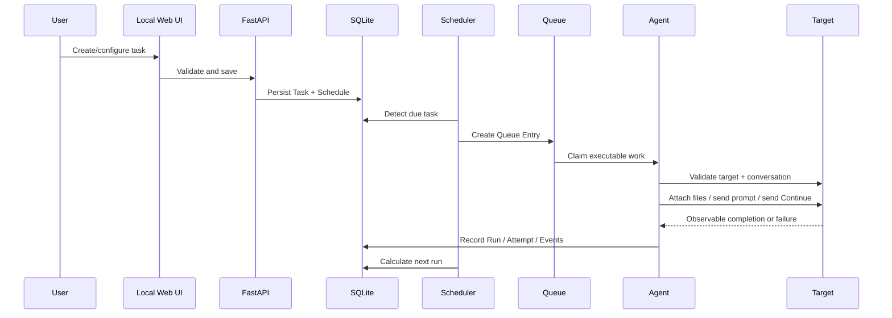
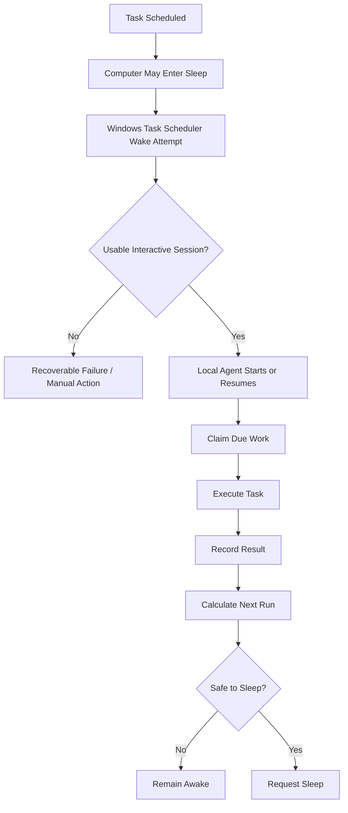

<div align="center">

# Local AI Task Automation System

### A local-first Windows automation platform for scheduling, resuming, and executing authenticated AI workflows without a mandatory cloud backend.

[](#development-status)
[](#technology-stack)
[](#technology-stack)
[](#technology-stack)
[](#supported-targets)
[](#installation-prerequisites)
[](#technology-stack)

[](https://github.com/Abtahi360/Local-AI-Task-Automation-System)
[](https://github.com/Abtahi360/Local-AI-Task-Automation-System)
[](https://github.com/Abtahi360/Local-AI-Task-Automation-System/issues)

**Schedule once. Execute locally. Resume reliably. Sleep when safe.**

</div>

> **Status:** The authoritative Phase 1 specification is **Draft — Pending User Approval**. Later implementation phases are therefore presented as planned unless the repository itself proves otherwise.

---

## What Is This Project?

The **Local AI Task Automation System** is a single-user, local-first Windows application for creating, scheduling, executing, monitoring, retrying, and reviewing tasks that interact with authenticated AI application targets.

It is designed for long-running AI workflows where a person otherwise has to repeatedly return to the computer, open the correct authenticated environment, locate the correct conversation, send `Continue` or a new prompt, optionally provide local files, wait for the target to respond, and repeat the process later.

The system automates that repetitive orchestration **on the user's own Windows computer**. It is an automation and scheduling layer around the target AI applications, not a replacement for them and not a new API for their services.

### Core positioning

| Principle | Project direction |
| --- | --- |
| Deployment | **Local-first, single Windows computer** |
| Cloud dependency | **None required** |
| Primary backend | **Python + FastAPI** |
| Persistence | **SQLite** |
| Browser automation | **Playwright** |
| Desktop automation | **Windows UI Automation / pywinauto** |
| Scheduling | **Application scheduler + Windows Task Scheduler** |
| Initial UI | **HTML, CSS, JavaScript** |
| Execution model | **Persistent queue with a single default worker** |
| Authentication | **User-managed, already-authenticated target sessions** |

---

## The Problem

Long-running AI work often becomes a repetitive resume loop:

```text
AI workflow starts
      |
      v
Session or workflow needs a later interaction
      |
      v
User must return to the computer
      |
      v
Open the correct authenticated AI environment
      |
      v
Open the correct conversation
      |
      +----------------------+
      |                      |
      v                      v
Type "Continue"       Enter a new prompt
                           |
                           +--> Optionally select local files
      |                      |
      +----------+-----------+
                 |
                 v
Wait for observable completion
                 |
                 v
Repeat later
```

The problem is not the AI model itself. The problem is the **repetitive human intervention required to resume scheduled work**.

The system addresses that workflow while retaining human control over task creation, target selection, scheduling, file selection, cancellation, review, and exception handling.

---

## The Solution

```text
Configure task
      |
      v
Select target
      |
      v
Select conversation
      |
      +------------------------------+
      |                              |
      v                              v
Prompt + optional files          Continue task
      |                              |
      +---------------+--------------+
                      |
                      v
                Set schedule
                      |
                      v
              Persist task in SQLite
                      |
                      v
             Scheduler creates due work
                      |
                      v
          Windows Task Scheduler coordinates wake
                      |
                      v
           Local automation agent executes
                      |
          +-----------+-----------+
          |                       |
          v                       v
   Browser target          Claude Desktop
          |                       |
          +-----------+-----------+
                      |
                      v
             Record execution result
                      |
                      v
              Calculate next run
                      |
                      v
          Evaluate safe-sleep policy
```

The result is a **local automation/orchestration layer** that keeps task state and execution state on the Windows machine while using the target applications through their observable user interfaces.

---

## Key Features

<table>
<tr>
<td valign="top" width="33%">

### Task Automation

- **Prompt Task** for user-defined prompt text.
- **Continue Task** for the exact initial-release instruction `Continue`.
- Optional local-file references for Prompt Tasks.
- Task enable/disable, pause/resume, cancel, archive, and manual execution flows.

</td>
<td valign="top" width="33%">

### Scheduling

- One-time execution.
- Recurring execution.
- Every-N-hours execution.
- Persisted `next_run_at` calculation.
- Missed-run handling.
- Windows local-time display with UTC-compatible persistence.

</td>
<td valign="top" width="33%">

### Reliability

- Persistent queue state.
- Single-worker default execution.
- Atomic queue claiming.
- Stale-claim recovery.
- Retry policies.
- Duplicate-execution protection.
- Manual action for uncertain outcomes.

</td>
</tr>
<tr>
<td valign="top">

### Supported Targets

- Google Chrome.
- Brave Browser.
- Microsoft Edge.
- Claude Desktop.

</td>
<td valign="top">

### Local Files

- Local path references.
- Metadata validation.
- Existence and accessibility checks.
- Multiple files with preserved order.
- Attachment workflows where the target supports them.

</td>
<td valign="top">

### Monitoring

- Execution history.
- Structured logs.
- Health/readiness checks.
- Execution evidence.
- Dashboard visibility.
- Diagnostic data.

</td>
</tr>
<tr>
<td valign="top">

### Windows Integration

- Windows Task Scheduler.
- Wake coordination.
- Safe return-to-sleep behavior.
- Power-event logging.

</td>
<td valign="top">

### Security Boundaries

- Localhost-first API.
- No hard-coded credentials.
- No password collection.
- Manual user authentication.
- Dedicated automation profiles.
- No CAPTCHA or authentication bypass.

</td>
<td valign="top">

### Local Operations

- SQLite-backed persistence.
- Local backup and restore.
- Startup recovery.
- Configuration management.
- Windows-specific packaging direction.

</td>
</tr>
</table>

---

## How It Works



### Execution flow



---

## Architecture

| Component | Responsibility |
| --- | --- |
| **Local Web UI** | Task creation/editing, dashboard, target configuration, scheduling, status, history, logs, retry/resume/cancel controls. |
| **FastAPI Backend/API** | Request validation, task/target management, health information, and database orchestration. |
| **Task Service** | Task business rules, state validation, schedule relationships, and task-version handling. |
| **Scheduler Service** | Due-task detection, next-run calculation, queue creation, and Windows Task Scheduler coordination. |
| **Queue Engine** | Due-work ordering, atomic claiming, duplicate prevention, and single-worker coordination. |
| **Automation Agent** | Actual target interaction, file validation, evidence collection, and structured results. |
| **Target Adapter Interface** | Isolates browser- and desktop-specific target behavior. |
| **Browser Executor** | Chrome, Brave, and Edge control through Playwright. |
| **Desktop Executor** | Claude Desktop control through Windows UI Automation and/or pywinauto. |
| **File Material Service** | Path normalization, file validation, metadata, and attachment preparation. |
| **SQLite Repository** | Durable local storage, transactions, migrations, and indexed queries. |
| **Logging & Monitoring** | Structured logs, execution events, audit information, and safe diagnostics. |
| **Configuration Service** | Defaults, validated configuration, environment overrides, and runtime settings. |
| **Windows Task Scheduler Integration** | Wake-task configuration and coordination of due-task execution. |
| **Power Management Integration** | Requests sleep only when safe and records power-operation failures. |
| **Local Filesystem** | Source files, logs, database, backups, screenshots, and configuration. |

### Architectural principles

1. **Local-first:** all required components operate locally.
2. **Modularity:** UI, API, scheduler, queue, persistence, and automation remain separate concerns.
3. **Adapter isolation:** target-specific UI behavior stays inside adapters.
4. **Persistent queue state:** scheduled work survives normal restarts.
5. **Idempotency where possible:** repeated internal operations should not create duplicate runs.
6. **Secure session handling:** use legitimate existing sessions; never store passwords.
7. **No hard-coded credentials:** secrets remain outside source.
8. **Recoverable execution:** failures become observable states.
9. **Testability:** components expose testable contracts.
10. **Explicit state transitions:** task-definition and execution-run lifecycles remain distinct.
11. **Cautious power management:** sleep occurs only when safe.
12. **No mandatory cloud dependency:** the system remains operational locally.

---

## Task Types

### Prompt Task

A Prompt Task represents a scheduled user-defined interaction.

| Field | Meaning |
| --- | --- |
| Prompt | Non-empty user-defined prompt text |
| Target | Selected supported AI application |
| Conversation | Specific target conversation reference |
| Files | Optional local file references |
| Schedule | One-time or recurring execution |

The execution pipeline validates the target, conversation, and file references before the agent sends the prompt.

### Continue Task

A Continue Task is intentionally narrow in the initial release:

- Target conversation is selected explicitly.
- The exact default continuation text is **`Continue`**.
- It can run once or recur according to the defined schedule.
- It is designed for resuming long-running work.
- It does **not** accept custom continuation text in the initial release.

This fixed semantic boundary is deliberate: a Continue Task must not accidentally send Prompt Task content or attached files.

---

## Scheduling Model

The scheduler supports three initial modes:

| Mode | Behavior |
| --- | --- |
| **One-time** | Executes once at a defined time. |
| **Recurring** | Repeats according to the configured recurrence definition. |
| **Every-N-hours** | Repeats on a positive hour interval. For Continue Tasks, fixed-delay from the last successful completion is the recommended default. |

### Scheduling guarantees and safeguards

- `next_run_at` is calculated and persisted.
- Scheduling state survives application and Windows restarts.
- Schedules are displayed in Windows local time and persisted in UTC-compatible form.
- Invalid intervals, timestamps, and contradictory recurrence settings are rejected.
- Missed one-time tasks should run as soon as possible unless expired.
- Missed recurring occurrences should normally be skipped rather than replayed as a burst of obsolete runs.
- Editing a schedule recalculates future runs without corrupting completed history.

---

## Queue and Execution Lifecycle

```text
Task Definition
      |
      v
Validate
      |
      v
Queue Entry
      |
      v
Claim
      |
      v
Execute
      |
      +--------------------+-------------------------+----------------------+
      |                    |                         |
      v                    v                         v
Success              Retryable Failure       Uncertain Outcome
      |                    |                         |
      v                    v                         v
Record Result        Schedule Retry          Manual Verification
      |                    |                         |
      v                    v                         +----> Resume/Retry
Schedule Next        Retry Attempt

Permanent Failure
      |
      v
FAILED
```

### Why a single worker?

The initial release uses a single execution worker because browser and desktop GUI automation share physical desktop resources. Serializing target interaction reduces collisions and the risk of two processes controlling the same browser or desktop session at once.

### Uncertain send outcomes

The system **must not blindly resend** when it cannot determine whether an externally visible send actually completed. The safe state is a manual-action path or another explicitly defined verification flow.

---

## Supported Targets

| Target | Automation | Session/Profile Model | Prompt | Continue | File Support |
| --- | --- | --- | :---: | :---: | --- |
| **Google Chrome** | Playwright | Dedicated persistent automation profile | ✓ | ✓ | Adapter-dependent |
| **Brave Browser** | Playwright | Dedicated persistent automation profile | ✓ | ✓ | Adapter-dependent |
| **Microsoft Edge** | Playwright | Dedicated persistent automation profile | ✓ | ✓ | Adapter-dependent |
| **Claude Desktop** | Windows UI Automation / pywinauto | Native application session | ✓ | ✓ | Adapter-dependent |

### Browser profile separation

Browser automation uses **persistent automation profiles** that are separate from the user's normal personal browser profiles by default.

The user performs the initial authentication manually. The automation layer then uses the configured automation profile for later execution.

The project does **not** extract, migrate, or harvest personal browser login sessions.

### Target readiness

Each target is expected to expose readiness/capability information such as:

- prompt support;
- Continue support;
- file-attachment support;
- conversation navigation;
- health-check support;
- executable/profile configuration;
- last validation state.

Conversation references are target-specific. A universal stable conversation ID is not assumed; a locator may be a direct URL, target-specific route, user-supplied identifier, or displayed title combined with a verification strategy.

---

## Local File Handling

The initial release uses a **local path + metadata** model rather than storing source-file binaries in SQLite.

Example reference:

```text
D:\Research\Paper\paper1.pdf
```

The system may persist metadata such as:

- filename;
- size;
- modified time;
- file type;
- optional hash/fingerprint where enabled;
- display order.

### Execution flow

```text
Local path
   |
   v
Normalize / validate reference
   |
   v
Check existence + accessibility
   |
   v
Read directly from local filesystem
   |
   v
Prepare attachment
   |
   v
Attach to target when supported
   |
   v
Execute task
```

Important boundaries:

- Source-file binary content is **not** stored in SQLite in the initial release.
- A missing or inaccessible file prevents execution unless the task has no file requirement.
- Multiple files may be referenced and their selected/reordered order must be preserved.
- The system may detect file changes where sufficient metadata is available.

---

## Sleep / Wake Workflow



### Sleep/wake constraints

Wake behavior depends on **Windows configuration, hardware, BIOS/UEFI, drivers, battery/power state, user session state, and wake-timer support**.

GUI automation also requires a usable interactive Windows session. The system does **not** automatically unlock the Windows login screen, and it does not guarantee GUI automation while the session is locked.

Automatic sleep is suppressed while:

- an automation task is running;
- a protected operation is active;
- a retry is immediately pending;
- recent user activity violates the configured sleep policy.

A successful end-to-end sleep/wake workflow therefore depends on the actual Windows machine and its configuration.

---

## State Model and Persistence

The specification separates reusable task definitions from concrete execution records.

### Logical entities

| Entity | Purpose |
| --- | --- |
| **Tasks** | Reusable automation definitions. |
| **Schedules** | Timing and recurrence definitions. |
| **Targets** | Local records for Chrome, Brave, Edge, and Claude Desktop. |
| **Conversations** | User-configured target conversation references. |
| **Task Files** | Local path references plus metadata. |
| **Queue Entries** | Concrete executable work created from due tasks. |
| **Execution Runs** | One scheduled/manual execution instance. |
| **Execution Attempts** | Individual attempts within a run. |
| **Execution Events** | Structured execution and diagnostic events. |
| **Retry Policies** | Attempt limits, delays, and retryable error classes. |
| **System Settings** | Local runtime/configuration values. |

SQLite is used because the initial system is a single-user local Windows application and does not require a separate database server.

### SQLite operational rules

- Foreign-key enforcement is required.
- WAL mode is required.
- Task claiming uses explicit transactions.
- A short busy timeout is expected.
- State transitions must remain deterministic.
- Schema changes are versioned through Alembic or equivalent migration tooling.
- Backups should be taken before production migrations.
- Restore is a deliberate administrative operation.

---

## Reliability and Recovery

The reliability model is centered on explicit state, observable outcomes, and conservative recovery.

| Concern | Strategy |
| --- | --- |
| Queue claim | Atomic reservation of work. |
| Duplicate execution | A run cannot be simultaneously claimed by multiple workers. |
| Worker crash | Recover stale `CLAIMED` / `RUNNING` work using timestamps and recovery rules. |
| Retry | Policy-driven retry with bounded attempts and calculated delay. |
| Permanent failure | Transition to a failed terminal state. |
| Uncertain send | Manual action / verification; never blind resend. |
| Missing file | `MANUAL_ACTION_REQUIRED` until fixed or cancelled. |
| Expired target session | Manual re-authentication in the configured automation profile. |
| Target UI change | Adapter fails safely rather than blindly clicking unknown elements. |
| Database failure | Transactional writes plus backup/restore procedures. |

---

## Technology Stack

| Layer | Technology | Role |
| --- | --- | --- |
| Core | **Python** | Application logic and Windows automation ecosystem. |
| API | **FastAPI** | Local REST API boundary. |
| Database | **SQLite** | Serverless local persistence. |
| ORM | **SQLAlchemy** | Persistence abstraction and repository model. |
| Migrations | **Alembic** | Versioned schema migrations. |
| Browser automation | **Playwright** | Chrome/Brave/Edge automation. |
| Desktop automation | **Windows UI Automation / pywinauto** | Claude Desktop interaction. |
| Scheduling | **Internal scheduler** | Durable business scheduling semantics. |
| OS scheduling | **Windows Task Scheduler** | Wake/start coordination. |
| Frontend | **HTML / CSS / JavaScript** | Initial lightweight local UI. |
| Testing | **pytest** | Automated testing ecosystem. |
| API testing | **FastAPI TestClient / httpx** | Local deterministic API verification. |
| Browser testing | **Playwright test patterns** | Real/control-browser testing. |
| Logging | **Python logging + structured formatting** | Application and execution logs. |
| Configuration | **TOML/YAML + environment overrides** | Human-readable configuration and overrides. |
| Packaging | **PyInstaller** | Practical Windows standalone packaging direction. |
| Version control | **Git** | Change management. |

### Intentionally excluded from the initial architecture

The initial system does **not** require Redis, Docker, PostgreSQL, MySQL, or a cloud queue. Those forms of infrastructure are future-scope only.

---

## Why These Technologies?

| Technology | Why it is used |
| --- | --- |
| **Python** | Strong fit for the Windows automation ecosystem and the overall application layer. |
| **FastAPI** | Lightweight, typed local API boundary that is easy to test. |
| **SQLite** | Local persistence without an external database server. |
| **Playwright** | Persistent browser contexts and mature browser automation capabilities. |
| **Windows UI Automation / pywinauto** | Native Windows desktop interaction for Claude Desktop. |
| **Windows Task Scheduler** | Windows-native wake/start integration. |
| **SQLAlchemy** | Clean persistence abstraction and repository layer. |
| **Alembic** | Established schema migration workflow alongside SQLAlchemy. |
| **pytest** | Standard, mature Python test ecosystem. |
| **HTML/CSS/JavaScript** | Lightweight local UI with minimal deployment complexity. |

---

## Security and Privacy

> 🔒 Security is a design boundary, not an optional deployment feature.

The project is intentionally built around controlled, user-authenticated local automation.

### Security principles

- **Local-first architecture:** required services run on the Windows computer.
- **Localhost API:** the initial API is not designed as a public Internet service.
- **No hard-coded credentials:** credentials are not embedded in source.
- **No password collection:** users authenticate target applications themselves.
- **User-controlled sessions:** only legitimately authenticated sessions are automated.
- **Dedicated browser profiles:** automation is separated from personal profiles by default.
- **Local file paths:** source files remain on the local filesystem.
- **Sensitive-log controls:** diagnostic output should be safely redacted.
- **No CAPTCHA bypass:** target safeguards are not circumvented.
- **No authentication bypass:** the system does not bypass access controls.
- **No rate-limit evasion:** service protections remain in force.
- **No credential extraction:** browser secrets and credentials are not harvested.
- **No locked-session automation:** Windows login unlock is outside the initial model.

### Session recovery

When a target session expires, the correct path is manual re-authentication in the configured automation profile, followed by a health check and task retry/resume. The system must not collect or store the user's password.

---

## What This Project Does Not Do

The initial architecture intentionally excludes:

- Oracle Cloud integration.
- VPS deployment as a requirement.
- Mandatory cloud hosting.
- Cloud databases.
- Public Internet-accessible APIs.
- Remote multi-user operation.
- Enterprise permission systems.
- CAPTCHA bypass.
- Authentication bypass.
- Credential harvesting.
- Extraction of secrets from browser profiles.
- Rate-limit evasion.
- Stealth automation.
- Parallel execution against the same target profile.
- Automatic unlocking of the Windows login screen.
- Guaranteed GUI automation while Windows is locked.
- Automatic recovery from every possible target UI redesign.
- Binary file storage in SQLite.
- Full AI response-body storage by default.

This boundary is intentional and should remain visible to contributors and users.

---

## Project Structure

```text
project/
├── backend/       # API and domain services
├── agent/         # automation runtime
├── frontend/      # local UI
├── database/      # SQLite database and backups
├── migrations/    # schema versioning
├── config/        # validated configuration
├── profiles/      # automation browser profiles; sensitive
├── logs/          # application logs
├── evidence/      # safe execution evidence, such as screenshots
├── scripts/       # installation, scheduling, diagnostics, maintenance
├── tests/         # automated tests
├── docs/          # project documentation
└── packaging/     # release/build artifacts
```

`profiles/` is sensitive because it may contain the persistent state used by automation sessions. It should not be treated like ordinary source code or published with credentials/session secrets.

---

## Development Status

### Current specification status

| Item | Status |
| --- | --- |
| Project specification | **Draft** |
| Phase 1 approval | **Pending User Approval** |
| Phase 2 start gate | **Not yet satisfied by default** |
| Later implementation status | **Not verified from the specification alone** |
| Production readiness | **Not claimed** |

The specification is Phase 1 — Requirement & System Specification. It is the contract that later development phases are expected to implement without silently redefining confirmed behavior.

### Definition of Ready for Phase 2

Phase 2 is gated on acceptance of the Phase 1 decisions and prerequisites, including:

- local-only architecture;
- task model;
- Prompt Task behavior;
- Continue Task behavior;
- target list;
- conversation reference strategy;
- local file path-only design;
- scheduling semantics;
- queue ordering;
- single-worker policy;
- state model;
- retry and uncertain-outcome policy;
- Windows wake/sleep limitations;
- security boundaries;
- database design;
- API structure;
- UI scope;
- acceptance criteria;
- risks;
- open decisions or defaults;
- Phase 2 environment prerequisites.

---

## Development Roadmap

The following phases are the implementation sequence defined by the specification. Because the repository's actual implementation state is not provided here, **planned** is the safe status for phases after the current specification phase.

| Phase | Scope | Status |
| --- | --- | :---: |
| **1** | Requirement & System Specification | 📝 Draft / Pending Approval |
| **2** | Development Environment Setup | ⏳ Planned |
| **3** | Database + Task Queue Engine | ⏳ Planned |
| **4** | Claude Target and Browser Profile Setup | ⏳ Planned |
| **5** | Browser Automation Engine | ⏳ Planned |
| **6** | Claude Desktop Automation | ⏳ Planned |
| **7** | File Material Pipeline | ⏳ Planned |
| **8** | Web UI Development | ⏳ Planned |
| **9** | Scheduling and Queue Execution | ⏳ Planned |
| **10** | Windows Sleep/Wake Automation | ⏳ Planned |
| **11** | State, Retry, Recovery | ⏳ Planned |
| **12** | Dashboard, Logs, Monitoring | ⏳ Planned |
| **13** | Packaging and Production | ⏳ Planned |

### Phase handoff intent

| Phase | Primary deliverables |
| --- | --- |
| **2** | Project skeleton, dependency setup, startup scripts, basic FastAPI app, SQLite initialization, environment documentation. |
| **3** | SQLAlchemy models, migrations, repositories, queue engine, state machine. |
| **4** | Target registry, browser configuration, health checks, profile validation. |
| **5** | Playwright adapter layer, Chrome/Brave/Edge adapters, safe locator handling, evidence capture. |
| **6** | `DesktopExecutor`, Windows UI Automation integration, Claude Desktop configuration. |
| **7** | Local file selector integration, metadata validation, file-reference persistence, attachment pipeline. |
| **8** | Dashboard, Prompt Task UI, Continue Task UI, task list, target UI, history, settings, validation. |
| **9** | Recurrence engine, next-run calculator, queue scheduling, wake-task synchronization logic. |
| **10** | Task Scheduler integration, wake-task registration, post-execution sleep logic, power-event logging. |
| **11** | Error taxonomy, retry engine, stale-state recovery, uncertain-outcome handling. |
| **12** | Monitoring screens, evidence, filtering, diagnostic bundle generation. |
| **13** | Packaged build, installation/startup/shutdown scripts, backup/restore tools, final documentation. |

---

## Quick Start

> **Repository-state note:** the specification defines the intended setup, but the actual repository contents and implementation commands are not independently verified here. Treat the commands below as a **planned/defined setup pattern**, not a claim that the repository already contains every referenced file.

### Planned / defined setup pattern

```powershell
python -m venv .venv
.\.venv\Scripts\Activate.ps1
pip install -r requirements.txt
```

The implementation plan calls for a requirements file and pinned dependency set during Phase 2. The exact dependency file name and repository commands should be verified against the implemented repository before publication.

### Initial machine preparation

1. Use a supported **Windows 10/11** environment.
2. Install the Python runtime required by the pinned dependency set.
3. Install **Git** for development workflows.
4. Install the target browsers you intend to automate.
5. Install **Claude Desktop** when that target is required.
6. Ensure sufficient local filesystem access and the permissions required for Windows Task Scheduler and application configuration.
7. Create dedicated browser automation profiles rather than reusing personal profiles.
8. Authenticate target applications manually in those automation profiles.
9. Validate target readiness before relying on long-running scheduled automation.

### Important

The local application can keep task storage, scheduling, and UI operation local without an Internet connection, but the target AI services generally require network availability for remote interaction.

---

## Installation Prerequisites

| Requirement | Why it is needed |
| --- | --- |
| **Windows 10/11** | OS-level power management and desktop automation dependencies. |
| **Python** | Core application and automation runtime. |
| **Git** | Development/version-control workflow. |
| **Supported browser(s)** | Chrome, Brave, and/or Edge browser targets. |
| **Claude Desktop** | Required only when the desktop target is used. |
| **Windows Task Scheduler** | Wake/start coordination. |
| **Sufficient permissions** | Setup, Task Scheduler, executable/profile configuration, and local file access. |
| **Local filesystem access** | SQLite database, profiles, logs, evidence, backups, and task files. |
| **Internet/network access** | Required by the remote target services during actual AI interaction. |

---

## Database and State Model

The persistence model is deliberately local and explicit.

### Core task lifecycle

```text
DRAFT
  |
  v
SCHEDULED <---- PAUSED
  |
  v
QUEUED
  |
  v
RUNNING
  |
  +--------> SUCCEEDED
  |
  +--------> RETRY_SCHEDULED
  |
  +--------> FAILED
  |
  +--------> MANUAL_ACTION_REQUIRED
  |
  +--------> CANCELLED / ARCHIVED
```

Exact state transitions are implementation contracts defined by the specification. The important invariant is that **task definition lifecycle and execution-run lifecycle remain separate**.

### Operational persistence expectations

- Task definitions survive application restart.
- Task definitions survive Windows restart.
- Scheduling state survives sleep/wake transitions.
- Execution history remains separate from the reusable task definition.
- Recovery can identify stale claims/runs after process failure.

---

## Monitoring, Logging, and Evidence

The system is intended to make automation behavior observable rather than opaque.

### Monitoring responsibilities

- Health/readiness of configured targets.
- Task state and schedule visibility.
- Execution history.
- Retry and recovery state.
- Queue state.
- Power/sleep/wake events.
- Structured execution events.
- Safe diagnostic evidence.

### Evidence principles

Execution evidence should help determine what happened without turning logs or screenshots into a repository for sensitive user content.

The initial direction favors **metadata and evidence** rather than storing complete AI responses by default.

---

## Testing Strategy

Testing is intentionally layered because GUI automation cannot be fully represented by ordinary application-unit tests.

| Test layer | Focus |
| --- | --- |
| **Unit tests** | Task validation, state transitions, schedule calculations, retry calculations, queue ordering, file validation, configuration parsing. |
| **Database tests** | Constraints, migrations, claiming, rollback, backup/restore, stale-run recovery. |
| **API tests** | CRUD, validation, error responses, state operations, pagination, filtering with adapters mocked. |
| **Scheduler tests** | One-time, every-N-hours, missed runs, pause/resume, expiration, clock adjustments. |
| **Adapter contract tests** | Shared target-adapter contract across supported targets. |
| **Playwright tests** | Controlled/mock browser scenarios plus real target end-to-end testing on the actual Windows machine. |
| **Desktop automation tests** | Real Windows UI behavior for Claude Desktop. |
| **Sleep/wake tests** | Sleep, wake, startup, interactive session, late wake, failed wake, return-to-sleep logic. |
| **Recovery tests** | Browser crash, agent crash, DB lock, network loss, missing file, expired session, conversation rename, locator changes. |
| **User acceptance tests** | Representative real tasks executed by the System Owner. |
| **Regression tests** | Adapter contract suite, regression suite, and real-target smoke test after adapter changes. |

> 🧪 **Real target automation requires real Windows/browser testing.** Native UI behavior and power-management behavior cannot be considered fully validated from mocked tests alone.

---

## Limitations

The system's credibility depends on making these limitations explicit.

| Limitation | Impact |
| --- | --- |
| **Target UI changes** | Browser or desktop redesigns can break locators or interaction sequences. |
| **Windows wake behavior** | Depends on hardware, firmware, drivers, power policy, and wake-timer support. |
| **Interactive session requirement** | GUI automation requires a usable user session. |
| **Authentication expiry** | Users may need to re-authenticate target sessions manually. |
| **Target upload differences** | File capabilities vary by target and adapter. |
| **Local file availability** | Paths remain usable only while files exist and are accessible. |
| **Application updates** | Browser/desktop updates can change executable paths, permissions, or UI structure. |
| **Automation profiles** | Correct target session state depends on correctly configured automation profiles. |
| **External-service changes** | Session policies, upload rules, target UI behavior, or service availability can affect automation. |
| **Sleep/wake conditions** | End-to-end unattended execution is not guaranteed on every Windows configuration. |

---

## Future Scope

The following are explicit future possibilities from the specification, not promises for the initial release:

- React frontend migration.
- Additional AI target adapters.
- Conditional workflows.
- More advanced task dependencies.
- Workflow templates.
- Advanced result extraction.
- Optional full response archiving.
- Multiple local Windows agents.
- LAN-controlled administration.
- Optional synchronization.
- Advanced visual locator recovery.
- Task-level notifications.
- More sophisticated workflow orchestration.

These items should remain separate from the committed initial architecture until formally adopted through the project's change-control process.

---

## Architecture Decision Highlights

| Decision | Direction | Why it matters |
| --- | --- | --- |
| **Local-only architecture** | Confirmed | Avoids mandatory cloud infrastructure and keeps scheduling/execution on the local PC. |
| **SQLite** | Confirmed | Appropriate for single-PC local persistence without a database server. |
| **Playwright** | Confirmed | Browser automation requirement with persistent browser contexts. |
| **Windows UI Automation / pywinauto** | Confirmed direction | Native desktop automation for Claude Desktop. |
| **Dedicated automation profiles** | Recommended default | Protects personal browser profiles. |
| **Single execution worker** | Recommended default | Reduces GUI collisions and simultaneous desktop control. |
| **Fixed `Continue` instruction** | Recommended default | Preserves clear semantic separation between task types. |
| **Local file path only** | Confirmed | Keeps source files on local storage rather than duplicating binary data into SQLite. |
| **Localhost API** | Confirmed | Supports local-only use without LAN/public exposure. |
| **Archive instead of destructive delete** | Recommended default | Preserves history. |
| **Skip stale recurring occurrences** | Recommended default | Prevents bursts of obsolete catch-up runs. |
| **Manual action for uncertain sends** | Recommended default | Prevents duplicate external submissions. |
| **No locked-session automation** | Recommended default | Avoids login/unlock bypass complexity. |
| **Safeguarded auto-sleep** | Confirmed direction | Supports unattended workflows without interrupting active operations. |

---

## Contributing

Contributions should improve the implementation without weakening the project's local-first architecture, safety boundaries, or recoverability guarantees.

### Useful contribution areas

- Target adapters.
- Scheduler and queue behavior.
- Windows integration.
- Testing and regression coverage.
- Documentation.
- Diagnostics and observability.
- Packaging and maintenance tooling.

---

## Final Scope Summary

<table>
<tr>
<td valign="top" width="50%">

### In Scope

- Local Windows deployment.
- Local Web UI.
- FastAPI backend.
- SQLite persistence.
- Task lifecycle management.
- Prompt Tasks.
- Continue Tasks.
- Chrome, Brave, Edge, Claude Desktop.
- Persistent browser automation profiles.
- Local file path storage.
- One-time, recurring, and every-N-hours schedules.
- Queue management and single-worker execution.
- Execution history.
- Logging and monitoring.
- Retry/recovery.
- Windows Task Scheduler.
- Wake/sleep coordination.
- Dashboard and configuration.
- Packaging.
- Local backup/restore.

</td>
<td valign="top" width="50%">

### Explicitly Out of Scope

- Mandatory cloud infrastructure.
- Oracle Cloud.
- VPS dependency.
- Cloud database.
- Remote multi-user access.
- Public Internet API.
- Authentication/CAPTCHA bypass.
- Credential harvesting.
- Rate-limit evasion.
- Stealth automation.
- Automated Windows unlock.
- Guaranteed locked-session automation.
- Binary file storage in SQLite.
- Full response-body storage by default.

</td>
</tr>
</table>

---

## Glossary

| Term | Definition |
| --- | --- |
| **Task** | Reusable user-defined automation definition. |
| **Prompt Task** | Task that sends user-defined prompt text. |
| **Continue Task** | Task that sends the exact default `Continue` instruction. |
| **Schedule** | Timing definition associated with a task. |
| **Queue Entry** | Concrete executable work item created from a due task. |
| **Execution Run** | One scheduled/manual execution instance. |
| **Execution Attempt** | One attempt within an Execution Run. |
| **Target** | Browser or desktop AI application environment. |
| **Target Adapter** | Adapter isolating target-specific UI behavior. |
| **Conversation** | User-configured conversation target. |
| **Automation Profile** | Browser profile dedicated to automation. |
| **File Reference** | Local path and metadata pointing to a source file. |
| **Retry** | Re-execution of a failed run under policy. |
| **Recovery** | Process of returning interrupted/failed work to a safe state. |
| **Wake Timer** | Windows scheduling capability used to wake the computer. |
| **Local-first** | Architecture where all required services operate on the user's computer. |
| **Manual Intervention** | User action required because automation cannot safely continue. |
| **Uncertain Outcome** | Condition where the system cannot determine whether an externally visible action completed. |
| **Queue Claim** | Atomic reservation of queued work by a worker. |
| **Fixed-Rate recurrence** | Next run based on the scheduled series rather than completion time. |
| **Fixed-Delay recurrence** | Next run based on completion of the previous successful run. |
| **Interactive Session** | A usable Windows user session in which GUI automation can operate. |
| **Evidence** | Safe diagnostic information showing what happened during execution. |

---

<div align="center">

Built for local-first AI workflow automation on Windows.

⭐ Star the project if you find it useful.

</div>
